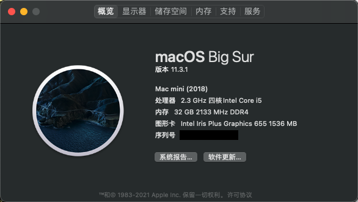

# NUC8I5BEH Hackintosh (OpenCore)

#### **EFI更新：**

2021-06-29
1、更新 OpenCore 0.7.0 正式版。
2、例行升级 kext 版本（AppleALC、NVMeFix、RestrictEvents、VirtualSMC、WhateverGreen）。
3、优化 OpenCore UI；解决部分显示器休眠后无法点亮屏幕的问题。

2021-05-12

* 更新 OpenCore 0.6.9 正式版。
* 例行升级 kext 版本（AppleALC、IntelMausi、Lilu、NVMeFix、RestrictEvents、VirtualSMC、WhateverGreen）。
* 集成读卡器驱动，默认禁用，自行开启（已硬改的请忽略）；优化缓冲帧补丁。

### Supported macOS versions

+ macOS Mojave
+ macOS Catalina
+ macOS Big Sur 11.2.1（using now）

### 配置
+ macOS Big Sur 11.2.1 19H524 x86_64 / Macmini8,1
+ OpenCore: 0.6.8
+ CPU: Intel® Core™ i5-8259U Processor (6M Cache, up to 3.80 GHz)
+ SSD: WD730 1TB
+ RAM: 32GB
+ BIOS: [0078](https://drivers.softpedia.com/get/BIOS/Intel/Intel-NUC8i5BEH-NUC-Kit-BIOS-0078.shtml)
+ Monitor: DELL U2518DR

### BIOS设置
+ __Disable__
	- Legacy Boot
	- Fast Boot
	- Network Boot
	- Secure Boot
	- Inter VT for directed I/VO(VT-d)
+ __Enable__
	- Boot USB Devices First
	- Boot Network Devices Last
+ __Wake on LAN from S4/S5__
	- Stay Off

### 使用方法
将 **EFI** 和 **NUC8_MacOnlineInstaller** 放入FAT32 U盘根目录，执行**NUC8_MacOnlineInstaller**中的run脚本，完成后使用U盘开机即可安装

### 修改三码以激活iMessage/FaceTime
macOS系统安装完成后，请使用[Hackintool]()生成**Serial Number**, **Board Serial Number** 和 **SmUUID**，并在*config.plist*中替换它们。

在[https://checkcoverage.apple.com](https://checkcoverage.apple.com)查询你的**Serial Number**，并确保查询结果如下图所示，否则继续摇号。

---

## Show your support

Give a ⭐️ if this project helped you!
